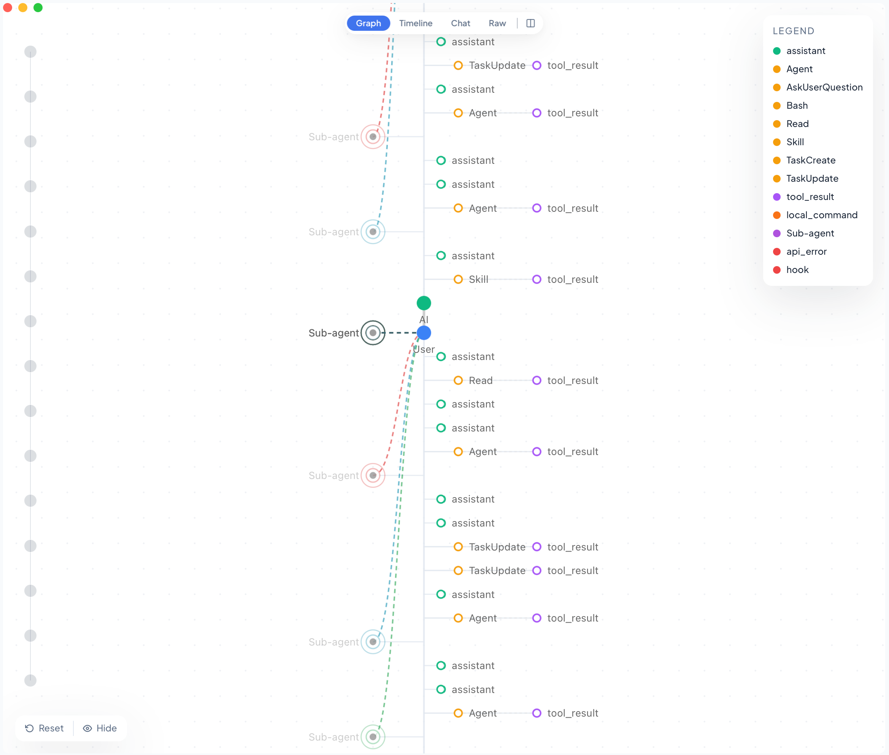
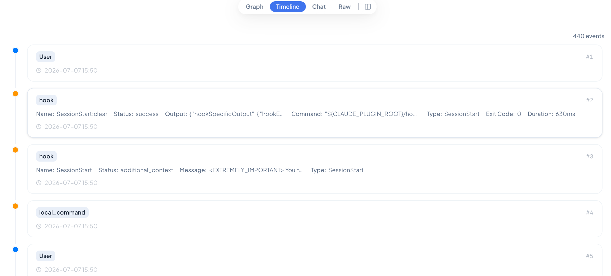
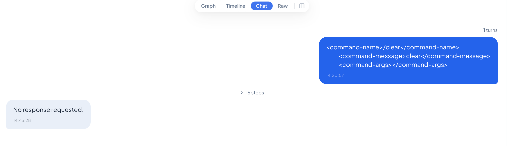
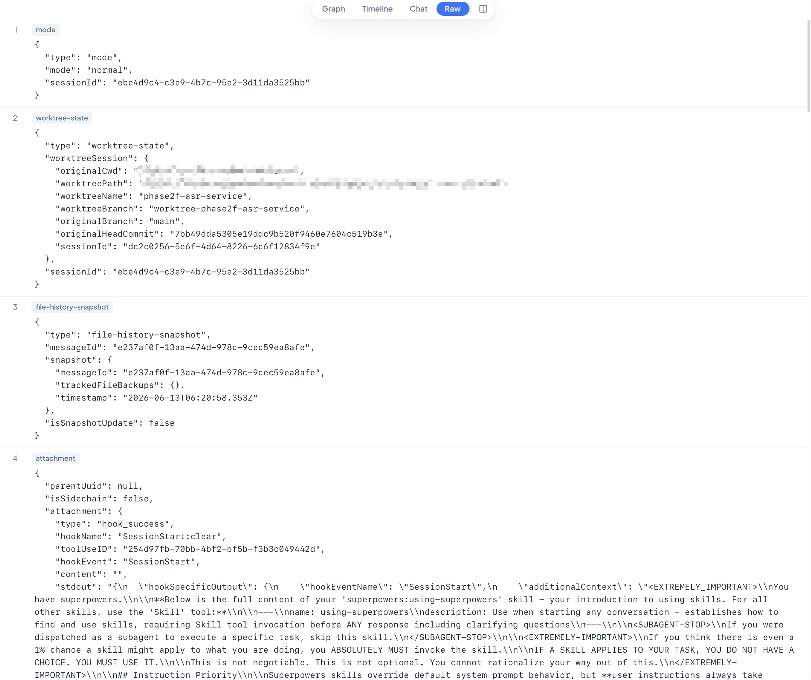
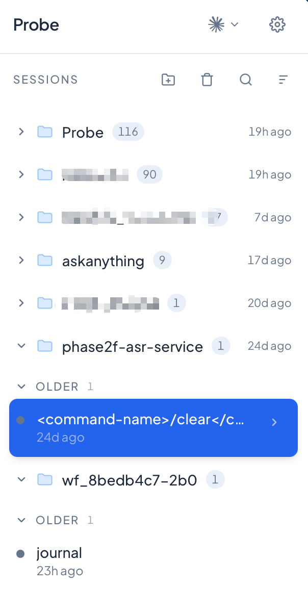
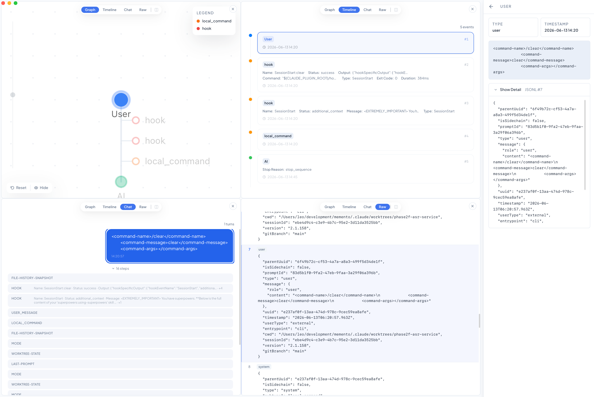

<p align="center">
  <picture>
    <source media="(prefers-color-scheme: dark)" srcset="./assets/icons/probe-logo-white-on-black.svg">
    
  </picture>
</p>

<h1 align="center">Probe</h1>

<p align="center">
  <a href="./README_EN.md">English</a> | 中文
</p>

<p align="center">
  给 AI 编程助手的会话日志，一个可读的家。<br/>
  导入 Codex CLI、Claude Code 的会话记录，用可视化界面回看每一次交互。
</p>

<p align="center">
  <a href="https://github.com/ChickmagnetL/Probe/releases"></a>
  
  
  
</p>

---

## 为什么需要 Probe

你每天都在用 Codex CLI、Claude Code 这类 AI 编程助手。它们在 `~/.codex`、`~/.claude` 下留下大量 `.jsonl` 会话日志——但每次想回头看，都要面对几万行的原始 JSON：

- 上次让 AI 改的那个 bug，它具体做了什么？调用过哪些工具？
- 这一轮对话花了多少 token？卡在哪一步？
- 子代理（subagent）是怎么被调度、又返回了什么？

**Probe 把这些日志变成可以浏览、搜索、回看的界面。** 

## 功能演示

https://github.com/user-attachments/assets/df564ce2-fa9c-4d70-acca-425f287938ad

## 核心功能

**多平台会话导入**
目前支持 Codex CLI 与 Claude Code 。单文件、整个目录、或自动扫描增量导入都可以。

**节点视图（Graph）**
用节点图展示一轮对话的完整走向——用户输入、模型回复、工具调用、命令执行、子代理派生，一眼看清整条链路。节点类型可按需筛选。



**时间线（Timeline）**
按事件发生顺序逐条浏览，定位到任意一步操作。



**对话视图（Chat）**
以熟悉的聊天界面查看模型与用户的完整交互内容。



**原始数据（Raw）**
原始 jsonl 文件转换成 json 排版，更方便观察原始数据。



**多会话管理**
按项目、按日期组织会话，支持搜索、排序，会话详情带缓存秒开。

<p align="center">
  
</p>

**分屏对照**
支持最多拆分四个分屏，同时预览、对照四个不同的视图，对一个视图中的节点点击时，其他视图也会随之跳转。



---

## 安装

### macOS

**方式一：Homebrew（推荐）**

```bash
brew install ChickmagnetL/probe/probe
```

Homebrew 安装的版本已剥离 Gatekeeper 隔离属性，装完直接能开。

升级 / 卸载：

```bash
brew upgrade probe
brew uninstall probe
```

**方式二：GitHub Release DMG**

从 [最新 Release](https://github.com/ChickmagnetL/Probe/releases/latest/download/Probe_aarch64.dmg) 下载 `.dmg`：

1. 打开 DMG，把 `Probe.app` 拖进 `/Applications`
2. 首次打开若提示"应用已损坏"，是 Gatekeeper 拦截，终端跑一下：
   ```bash
   xattr -cr /Applications/Probe.app
   ```
3. 再次打开即可

### Windows

从 [最新 Release](https://github.com/ChickmagnetL/Probe/releases/latest/download/Probe_x64-setup.exe) 下载 `.exe` 安装包。

---

## 快速上手

1. 选择导入自己想查阅的单个会话文件，或者全部会话文件的文件夹，亦或者等待应用自动同步电脑上的 Codex CLI 和 Claude Code 会话。 
2. 会话导入完成后，右侧栏中点击会话列表开始预览。

---

## 技术栈

Probe 是一个 Tauri v2 桌面应用，由三层组成：

| 层 | 技术 | 职责 |
|----|------|------|
| Engine | Python | 解析 JSONL、持久化到 SQLite、响应查询 |
| Shell | Rust / Tauri v2 | 原生窗口、IPC 分发、管理 engine 子进程 |
| UI | React + TypeScript + Tailwind | 可视化界面、交互、本地状态 |

更详细的技术文档见 [`docs/`](./docs/)。

---

## 参与贡献

欢迎提 Issue 反馈 bug、建议新功能，或直接发 PR。

本地开发：

```bash
git clone https://github.com/ChickmagnetL/Probe.git
cd Probe

# 1. 构建前端依赖
cd frontend && npm install && cd ..

# 2. 构建后端 Python engine sidecar（需要 Python ≥ 3.10 与 pyinstaller）
./build.sh sidecar

# 3. 启动桌面开发模式（同时拉起前端、Rust shell 与 engine）
cd tauri && cargo tauri dev
```

前置依赖：Node.js、Rust（含 Tauri CLI）、Python ≥ 3.10 与 `pyinstaller`。

完整开发说明见 [`docs/architecture.md`](./docs/architecture.md)。

## 许可证

MIT

## 致谢

[Linux.Do](https://linux.do/) 社区
